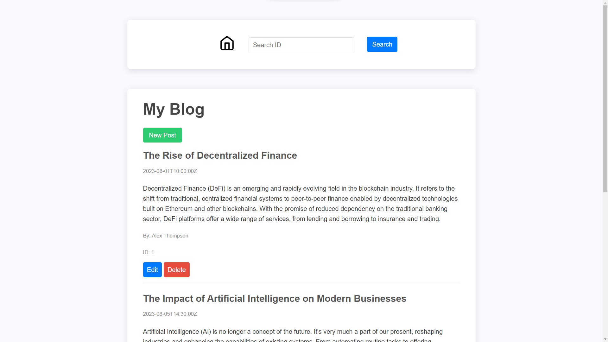

# Blog Website (Server + API)
This is a simple web project where users can interact with the Blogs. Users can create new posts, edit posts, delete posts and search for a particular post with ID. The API was fully created by me and other parts were already given.



## Installation
1. Clone the repository: [https://github.com/BaratovSokhibjon/Blog-Website-API-Server.git](https://github.com/BaratovSokhibjon/Blog-Website-API-Server.git)
2. Install Node JS and npm (once):
  - Make sure you are at the correct directory
  - Install the latest version of Node from [Node install page](https://nodejs.org/)
  - If you follow the default installation settings, it should install npm too
  - run ``` node -v ``` to check if you installed node properly

## Usage
To run the project, use the following command in your terminal:
1. Run the API file (everytime): 
```bash
node index.js 
``` 
2. Run the server file (everytime): 
```bash
node server.js
```

3. Go to [http://localhost:3000/](http://localhost:3000/) on your browser.
4. The API should be running on [http://localhost:4000/](http://localhost:4000/)


## Contributing
1. Fork the repository.
2. Create a new branch: `git checkout -b feature-name`.
3. Make your changes.
4. Push your branch: `git push origin feature-name`.
5. Create a pull request.